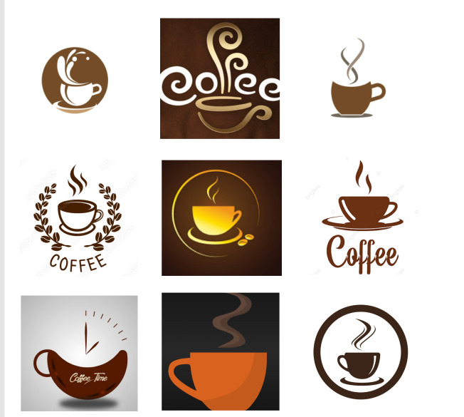
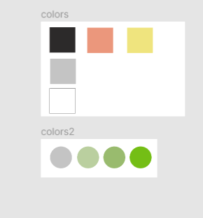
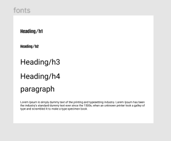
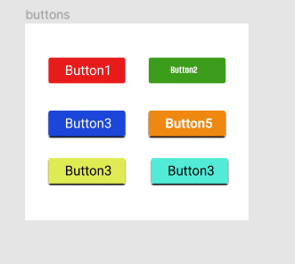
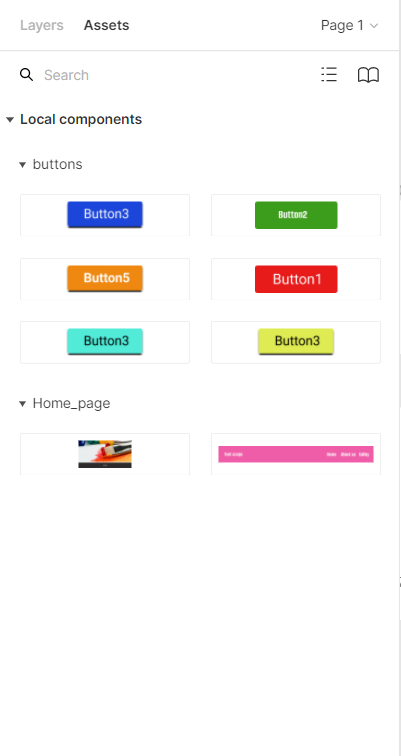

# dsgn270-codejournal

## March 9, 2022

- Today, in class we try to recreate logo.

- try to trace images using pen tool.i'm not good to use pen tool so i select simple image and traced it.

- we create moodboard i labtime.
  

### Logo design process

- I was searching through the internet for simple logo design.

- i found bunch of logos simple, elegant at the same time i feel like i can design them.

- i screencap it and design the moodboard.
  

- i just select one from the above which is look like butterfly.

- i try to design using shapes but it's not look like butterfly.
  

- so i try to use pen tool, and i did it.

  

- export into SVG format.

- optimized using SVGOMG and import into the html file.

- added the colors using css.

## March 10, 2022

- today we learned how to export SVG image and how to use it in VS code.

- we can use SVG in VS code two methods

  - <svg> </svg>

  - using  tag.

- we can style them using inline class.

## March 11, 2022

### Mockup Design

- In calss, today we create some library and published it.

- i created components for colors, fonts and buttons.

  - 

  - 

  - 

  - 

- and also try todo navbar components.
